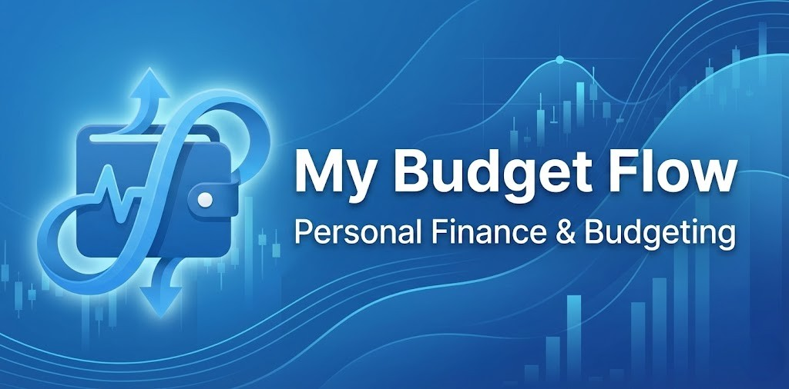
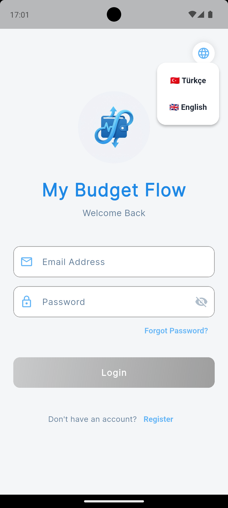
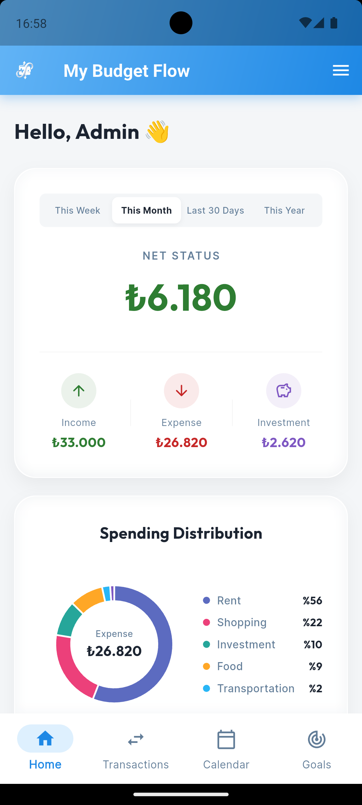
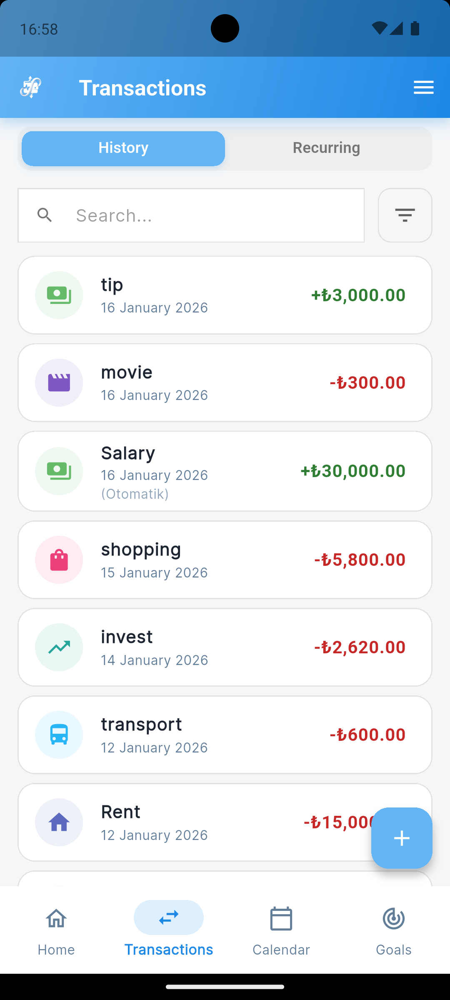
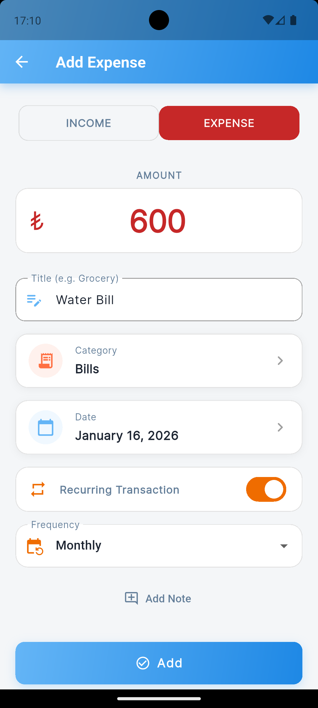
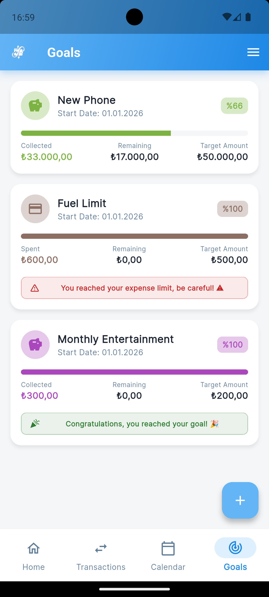
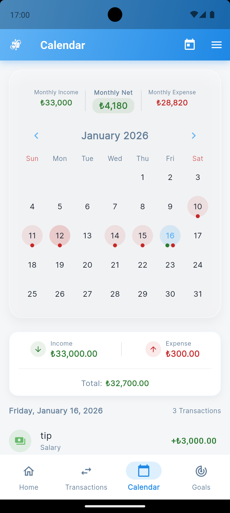

# 💰 My Budget Flow



<p align="center">
  <a href="#türkçe">Türkçe</a> •
  <a href="#english">English</a>
</p>

---

<h2 id="türkçe">🇹🇷 Türkçe</h2>

### 🚀 Proje Hakkında

**My Budget Flow**, kişisel finans yönetiminizi kolaylaştırmak için tasarlanmış, modern ve kullanıcı dostu bir mobil uygulamadır. Gelir ve giderlerinizi takip edebilir, bütçe hedefleri belirleyebilir ve finansal durumunuzu grafiklerle analiz edebilirsiniz.

Cebinizdeki mobil muhasebeciniz ile finansal özgürlüğe bir adım daha yaklaşın!

### ✨ Özellikler

- **🔐 Güvenli Kimlik Doğrulama:** Firebase altyapısı ile güvenli giriş ve kayıt işlemleri.
- **💸 Gelir & Gider Takibi:** İşlemlerinizi kolayca ekleyin, düzenleyin ve kategorilere ayırın.
- **🎯 Finansal Hedefler:** Yatırım veya harcama hedefleri oluşturun, ilerlemenizi takip edin.
- **📅 Akıllı Takvim:** Geçmiş işlemlerinizi takvim görünümü üzerinden gün gün inceleyin.
- **📊 Detaylı Analizler:** Harcamalarınızı ve gelirlerinizi şık grafiklerle görselleştirin.
- **🌍 Çoklu Dil Desteği:** Türkçe ve İngilizce dil seçenekleri.
- **📱 Modern Arayüz:** Kullanıcı deneyimini ön planda tutan şık tasarım.

### ⚙️ Kullanılan Teknolojiler

Bu proje, en güncel ve güçlü teknolojiler kullanılarak geliştirilmiştir:

- **[Flutter](https://flutter.dev/):** Cross-platform mobil uygulama geliştirme kiti.
- **[Dart](https://dart.dev/):** Uygulamanın yazıldığı programlama dili.
- **[Firebase](https://firebase.google.com/):** Backend, Auth ve Veritabanı (Firestore) işlemleri için.
- **[Riverpod](https://riverpod.dev/):** Güçlü ve test edilebilir statik state yönetimi.
- **[FL Chart](https://pub.dev/packages/fl_chart):** Etkileyici grafikler ve veri görselleştirme için.
- **[Table Calendar](https://pub.dev/packages/table_calendar):** Özelleştirilebilir takvim görünümü için.

### 📂 Proje Yapısı

Feature-First (Özellik Odaklı) mimari ile geliştirilmiştir:

```
my_budget_flow/
├── android/          # Android native kodları
├── ios/              # iOS native kodları
├── lib/              # Ana uygulama kodları
│   ├── core/         # Tema, sabitler ve yardımcı araçlar
│   ├── features/     # Uygulama özellikleri (Feature-First)
│   │   ├── auth/         # Giriş/Kayıt işlemleri
│   │   ├── dashboard/    # Ana gösterge paneli
│   │   ├── transactions/ # Gelir/Gider işlemleri
│   │   ├── goals/        # Hedef yönetimi
│   │   └── calendar/     # Takvim işlemleri
│   ├── l10n/         # Yerelleştirme dosyaları (Dil desteği)
│   └── main.dart     # Uygulama giriş noktası
├── assets/           # Görseller, ikonlar ve fontlar
├── pubspec.yaml      # Bağımlılıklar ve paket yönetimi
└── README.md         # Proje dokümantasyonu
```

### 📦 Kurulum ve Kullanım

1.  **Projeyi Klonlayın:**

    ```bash
    git clone https://github.com/basarob/my_budget_flow.git
    cd my_budget_flow
    ```

2.  **Paketleri Yükleyin:**

    ```bash
    flutter pub get
    ```

3.  **Firebase Kurulumu:**
    Projenin çalışması için kendi `google-services.json` (Android) ve `GoogleService-Info.plist` (iOS) dosyalarınızı ilgili klasörlere eklemeniz gerekmektedir.

4.  **Uygulamayı Çalıştırın:**
    ```bash
    flutter run
    ```

### 📸 Ekran Görüntüleri

|                          Giriş                           |                        Ana Sayfa                         |                          İşlemler                          |
| :------------------------------------------------------: | :------------------------------------------------------: | :--------------------------------------------------------: |
|  |  |  |
|                     **İşlem Ekleme**                     |                       **Hedefler**                       |                         **Takvim**                         |
|  |  |      |

---

<h2 id="english">🇬🇧 English</h2>

### 🚀 About The Project

**My Budget Flow** is a modern and user-friendly mobile application designed to streamline your personal finance management. Track your income and expenses, set budget goals, and analyze your financial status with intuitive charts.

Get closer to financial freedom with your pocket accountant!

### ✨ Features

- **🔐 Secure Authentication:** Safe login and registration powered by Firebase.
- **💸 Income & Expense Tracking:** Easily add, edit, and categorize your transactions.
- **🎯 Financial Goals:** Create investment or expense goals and track your progress.
- **📅 Smart Calendar:** Review past transactions day by day via the calendar view.
- **📊 Detailed Analytics:** Visualize your spending and income with sleek charts.
- **🌍 Multi-Language Support:** English and Turkish language options.
- **📱 Modern UI:** Stylish design prioritizing user experience.

### ⚙️ Tech Stack

Built with the latest and most powerful technologies:

- **[Flutter](https://flutter.dev/):** UI toolkit for building natively compiled applications.
- **[Dart](https://dart.dev/):** The programming language used.
- **[Firebase](https://firebase.google.com/):** For Backend, Auth, and Database (Firestore).
- **[Riverpod](https://riverpod.dev/):** Robust and testable state management.
- **[FL Chart](https://pub.dev/packages/fl_chart):** For impressive charts and data visualization.
- **[Table Calendar](https://pub.dev/packages/table_calendar):** For customizable calendar views.

### 📂 Project Structure

Developed using Feature-First Architecture:

```
my_budget_flow/
├── android/          # Native Android code
├── ios/              # Native iOS code
├── lib/              # Main application code
│   ├── core/         # Theme, constants, and utilities
│   ├── features/     # App features (Feature-First)
│   │   ├── auth/         # Authentication
│   │   ├── dashboard/    # Main dashboard
│   │   ├── transactions/ # Transactions
│   │   ├── goals/        # Goal management
│   │   └── calendar/     # Calendar operations
│   ├── l10n/         # Localization files
│   └── main.dart     # Entry point
├── assets/           # Images, icons, and fonts
├── pubspec.yaml      # Dependencies
└── README.md         # Project documentation
```

### 📦 Installation & Usage

1.  **Clone the Project:**

    ```bash
    git clone https://github.com/basarob/my_budget_flow.git
    cd my_budget_flow
    ```

2.  **Install Dependencies:**

    ```bash
    flutter pub get
    ```

3.  **Firebase Setup:**
    To run the project, you need to add your own `google-services.json` (Android) and `GoogleService-Info.plist` (iOS) files to the respective directories.

4.  **Run the App:**
    ```bash
    flutter run
    ```

### 📸 Screenshots

|                          Login                           |                        Dashboard                         |                        Transactions                        |
| :------------------------------------------------------: | :------------------------------------------------------: | :--------------------------------------------------------: |
|  |  |  |
|                   **Add Transaction**                    |                        **Goals**                         |                        **Calendar**                        |
|  |  |      |

### 🤝 Contributing

Contributions are welcome! Please feel free to submit a Pull Request.

### 📄 License

Distributed under the MIT License. See `LICENSE` for more information.
